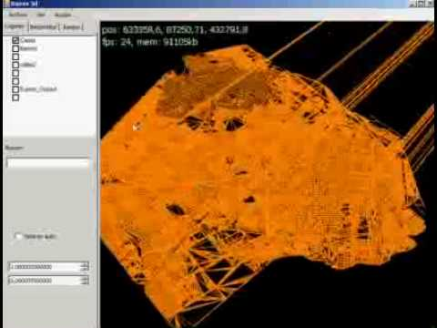
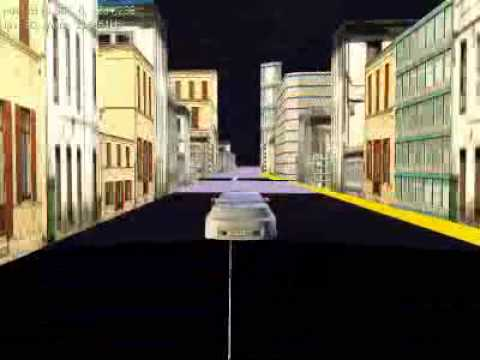
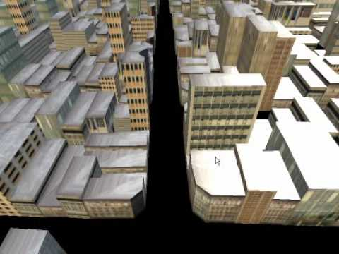

# baires3d

Baires3D is something I worked on from around 2007 to 2013. The idea was to build a free, interactive 3D map of Buenos Aires, with real streets, multiplayer interactions, and layers of useful city data.

Back in 2009, I wrote the following to describe it:

> Baires3D is my attempt to create a free software that allows users to explore the city of Buenos Aires, capital of Argentina, in three dimensions.
> It will feature an information query system (police stations, hospitals, transport, businesses, schools, etc.), multiplayer games, and much more.
>
> Currently in development:
> * Interaction with other users through car races, train and subway rides on real-life streets.
> * A route-planning system for car, public transport, train, or walking, optimized according to values such as comfort and available money.
> * Integrated neighborhood chat and forums.
> * Virtual excursions or tours.
> * Integration with Facebook and other social networks.
> * Visualization of scientific and educational information (planning, terrain analysis, hydrology, agronomic engineering, and other fields).

Of course, none of this saw the light of day, even though many of these features were mostly complete.

I should have released this years ago, and see where life would take me. I opted to shelve this, and dedicated myself entirely to regular employment.

This code is bad, but it's a snapshot of my reality those days. I was eager, and an addiction to GTA San Andreas multiplayer (through SAMP) didn't help things.

It's inconsistent, messy, full of hardcoded paths, dead ends, and practices that should by now be outright banned. I am ashamed by this code, but in a way, I'm not. I realize now, more than 15 years ahead, that it was SOMETHING. 
I poured a lot of time and energy into it, in detriment of many other things, but it sure taught me a lot.

At one point, I was even meeting local mappers in Buenos Aires cafés to exchange ESRI shapefiles (and many other formats) burned onto DVDs. That’s how deep I was in.

This release includes source code from December 2009 (though it's a mess) and some builds from different dates, including those made in 2013 with Unity3d. Source code for the Unity3d project will soon follow.

# Thoughts

Looking back, here's what I remember:

There was a time when there was no easy (legal) way to access information about the "parcelas", or parcels, in Buenos Aires. These were individual buildings and demarcations each city block had. The only authoritative source was tile-rendered at mapa.buenosaires.gob.ar.

I wrote a bot that grabbed all the map tiles for Buenos Aires, concatenated them and created a huge bitmap file.

I then used Vextractor to convert this bitmap file to vectors.
Realizing an extremely huge bitmap file would complicate things with Vextractor, I opted to split this bitmap into sections.
Then, I converted each section to vectors and later stitched them with a combination of OpenJump and QGIS, both wonderful pieces of software.

This bot would also fetch information about each parcel, wich resulted in an image (a photo of the parcel) an some fields.

One of those fields was "sr", or "sobre rasante", which meant the amount of floors that each parcel had.

Many parcels were special cases, like parks, parking lots, special government buildings, etc. But, for the most part, parcels with a "sr" of, say, 12, meant that it was a building that had 12 floors.

Based on this, my attempt was to triangulate the original 2d shapres and extrude them to 3d.

I even wrote a tool that allowed me to see each parcel and the photo it had so that I could mark it as being of a specific type of building.

As most people know, Buenos Aires has a ton of varied architecture, many of which is based on European (particularily French) architectural movements, and this of course proven a challenge.

# Videos

